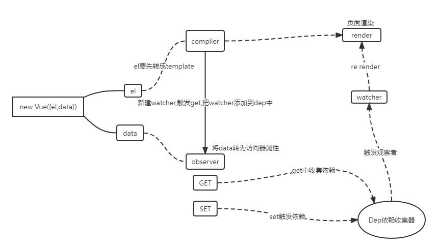
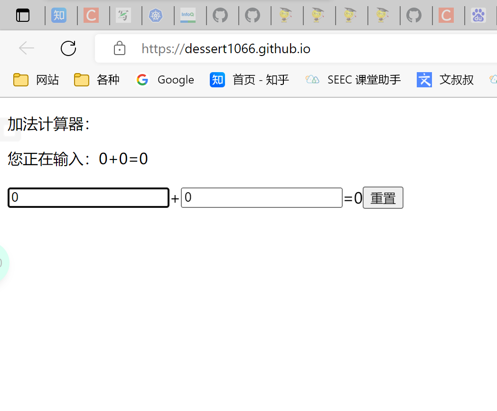
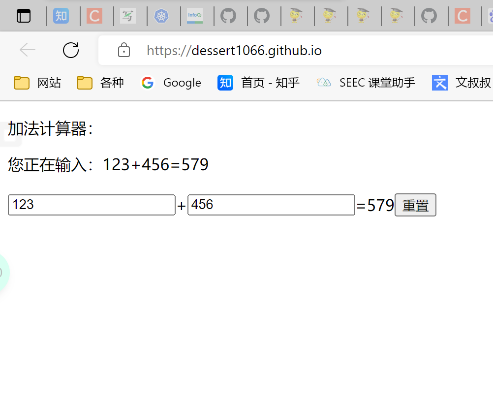
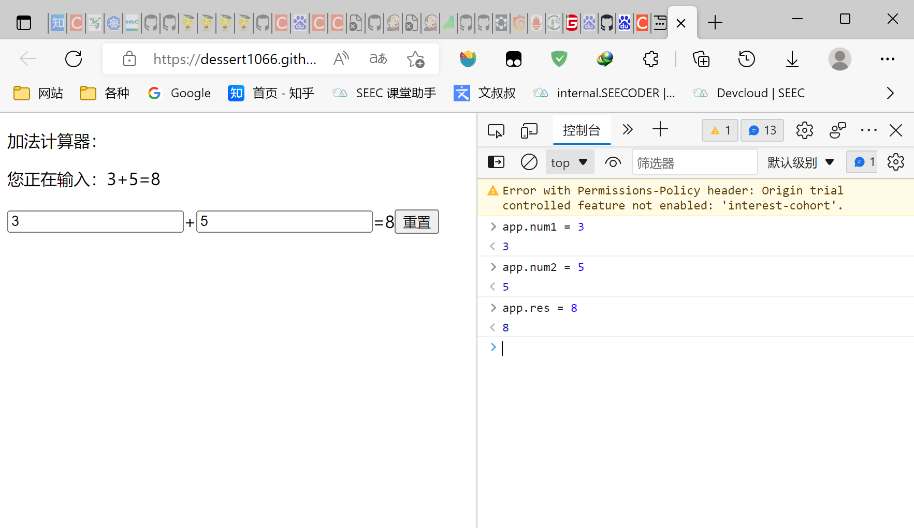
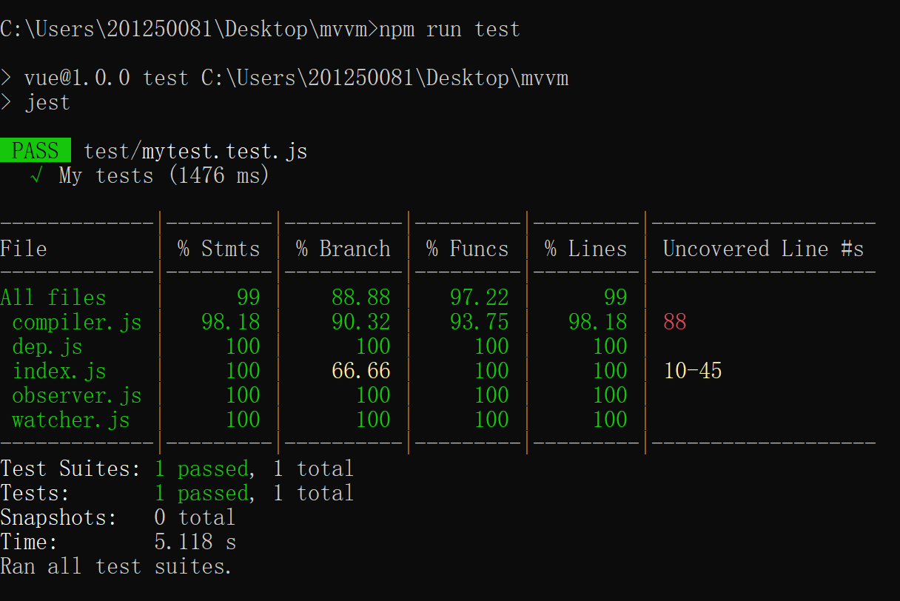

# 结课作业提交仓库

姓名：戎润祥
学校：南京大学
专业：软件工程
年级：大二
QQ：1609728997@qq.com

实现了一个简单的MVVM框架，包括：

* 实现数据劫持

* 实现发布订阅模式

* 实现数据单项绑定

* 实现双向绑定

<b>页面在example/demo.html中</b>

1. 实现一个数据监听器Observer，完成对数据的劫持，动态设置响应式数据。

2. 实现了一个模板编译器Compiler，编译模板、节点以及函数，并实现从文本向表达式的转化，通过订阅者，完成Model => View的响应式设计。

3. 实现一个Watcher，作为连接Observer和Compiler的桥梁，能够订阅并收到每个属性变动的通知，执行指令绑定的相应回调函数，从而更新视图

4. 通过Vue类整合以上组件，使用其功能，完成整体框架的实现。

   

<b>页面展示：</b>

1. 进入页面：

2.修改输入框中的数字，上面text中的数字同时修改，并且同时计算出结果：

3.通过控制台修改数值，页面同时修改

1. 使用jest，完成对整体框架功能的测试，单测覆盖率超过80%。

   指令：npm run test

